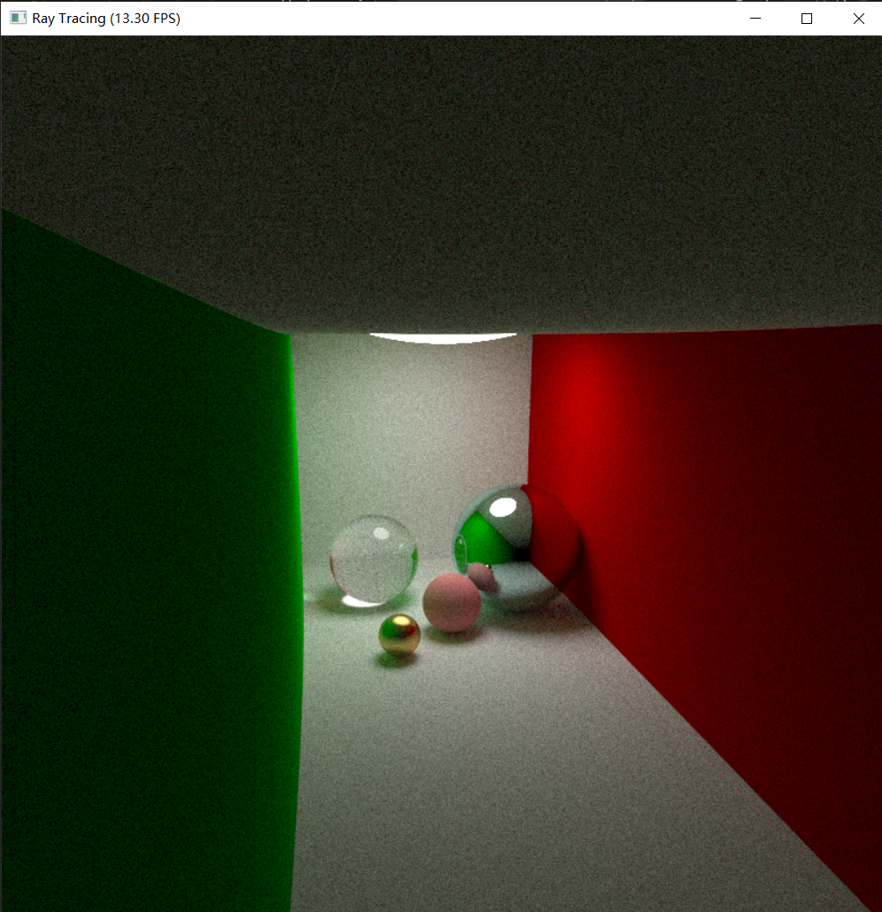

# 太极图形课S1-Ray Tracer

在Path Tracing的基础上支持了摄像头移动功能。

## 背景简介
因为在Path Tracing中，画面是持续更新的，所以考虑了一下移动摄像头的方案，需要在移动完摄像头之后手动把所有的pixel变黑，重新进行path tracing。

（有思考过是否可以用某种矩阵的变换来把屏幕中的某些pixel从旧位置映射到新位置，但是没有想的很清楚，并且在图像的边缘（原来不在画面内）的pixel没有包含信息，所以就干脆重新tracing了。

## 成功效果展示

## 整体结构（Optional）

## 运行方式
`python3 movable_ray_tracer.py` ，上下左右是移动位置，鼠标滚轮是zoom in/zoom out. 
